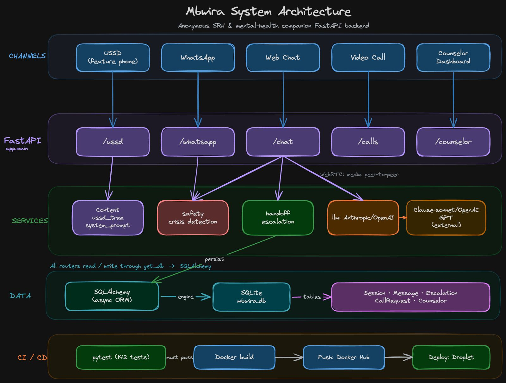

# Mbwira

**Ubuzima bwawe, ibanga ryawe.** *(Your health, your secret.)*

### Demo video

[Watch the demo on YouTube](https://youtu.be/MYVuEn4LJV8)

---

Mbwira is a privacy-first digital support platform for young people in Rwanda seeking help with sensitive topics — sexual and reproductive health, mental health, gender-based violence, and unwanted pregnancies. It combines a USSD channel that works on any phone, WhatsApp, a web chat, and an anonymous video call bridge, with an automatic escalation pipeline to counsellors — so nobody has to choose between staying anonymous and getting real help.

**Live deployment:** [mbwira.iraelie.tech](https://mbwira.iraelie.tech)

Built by **Team Achievers**, BSc Software Engineering, African Leadership University.

---

## Project status

| Channel / Feature | Status |
|---|---|
| USSD channel (Africa's Talking) | ✅ Implemented |
| Web chat (Kinyarwanda / English) | ✅ Implemented |
| WhatsApp channel (Meta Cloud API) | ✅ Implemented |
| Anonymous video calls (WebRTC) | ✅ Implemented |
| Counsellor dashboard | ✅ Implemented |
| Safety pre-filter and LLM escalation detection | ✅ Implemented |
| Session, message, and escalation persistence | ✅ Implemented |
| Automated test suite (147 tests) | ✅ Implemented |
| CI/CD pipeline (test → build → push → deploy) | ✅ Implemented |
| Per-counsellor accounts (replacing the shared password) | 🔜 Planned |
| Migration from SQLite to PostgreSQL | 🔜 Planned |

This is an active student project under continuous development, not a finished product. See [Notes and limitations](#notes-and-limitations) before relying on it for anything beyond demonstration and testing.

---

## The anonymity guarantee

Anonymity is the core design constraint, not a feature bolted on afterwards. It shapes the data model:

- **No raw phone numbers are ever stored.** USSD and WhatsApp numbers are reduced to a one-way SHA-256 `phone_hash` at the moment they arrive ([`ussd.py`](backend/app/routers/ussd.py), [`whatsapp.py`](backend/app/routers/whatsapp.py)). WhatsApp replies use the number from the live request, which is never persisted.
- **Sessions are random tokens.** A session is identified by an unguessable token, not by a person.
- **Counsellors cannot unmask users.** The dashboard's `reveal-contact` and `send-message` endpoints deliberately refuse — there is no stored number to reveal ([`counselor.py`](backend/app/routers/counselor.py)).
- **Video calls carry no identity.** The room ID is a random secret, and media flows peer-to-peer over WebRTC; the server relays only connection setup and never sees the call ([`calls.py`](backend/app/routers/calls.py)).
- **Sensitive actions are audited.** Counsellor actions such as joining a call are written to the transcript as `[AUDIT]` / `[CALL]` system messages.

---

## What the project includes

- **Web chat** with a language picker — [`backend/app/routers/chat.py`](backend/app/routers/chat.py)
- **USSD callback handler** compatible with Africa's Talking — [`backend/app/routers/ussd.py`](backend/app/routers/ussd.py)
- **WhatsApp Cloud API webhook**, including Meta's verification handshake — [`backend/app/routers/whatsapp.py`](backend/app/routers/whatsapp.py)
- **Anonymous video call bridge** with a WebRTC signalling WebSocket — [`backend/app/routers/calls.py`](backend/app/routers/calls.py)
- **Counsellor dashboard API** — escalation queue, transcripts, resolution, and stats — [`backend/app/routers/counselor.py`](backend/app/routers/counselor.py)
- **Bilingual (Kinyarwanda/English) USSD menu tree** — [`backend/app/content/ussd_tree.py`](backend/app/content/ussd_tree.py)
- **Two-stage safety scanning and escalation** — [`safety.py`](backend/app/services/safety.py) and [`handoff.py`](backend/app/services/handoff.py)
- **Provider-agnostic LLM integration** (Anthropic or OpenAI) — [`backend/app/services/llm.py`](backend/app/services/llm.py)
- **Async persistence layer** — [`backend/app/models/db.py`](backend/app/models/db.py)
- **147 automated tests** — [`backend/tests/`](backend/tests/)
- **Static landing page, chat UI, dashboard, call page, and USSD simulator** — [`frontend/`](frontend/)
- **Dockerized deployment with a test-gated CI/CD pipeline** — [`.github/workflows/ci.yaml`](.github/workflows/ci.yaml) and [`Dockerfile`](Dockerfile)

---

## Repository structure

```text
mbwira/
├── .github/
│   └── workflows/
│       └── ci.yaml                 # Test → build → push → deploy pipeline
├── backend/
│   ├── .env.example
│   ├── pytest.ini
│   ├── requirements.txt
│   ├── requirements-dev.txt
│   ├── app/
│   │   ├── config.py               # Pydantic settings, loaded from .env
│   │   ├── main.py                 # FastAPI app, routers, static mounts
│   │   ├── content/
│   │   │   ├── system_prompt.py    # LLM persona, safety rules, escalation format
│   │   │   └── ussd_tree.py        # Bilingual USSD menu tree
│   │   ├── models/
│   │   │   └── db.py               # SQLAlchemy models + async engine
│   │   ├── routers/
│   │   │   ├── calls.py            # Video call requests + WebRTC signalling
│   │   │   ├── chat.py             # Web chat
│   │   │   ├── counselor.py        # Counsellor dashboard API
│   │   │   ├── ussd.py             # Africa's Talking USSD callback
│   │   │   └── whatsapp.py         # WhatsApp Cloud API webhook
│   │   └── services/
│   │       ├── handoff.py          # Escalation creation + deduplication
│   │       ├── llm.py              # Anthropic / OpenAI wrapper
│   │       └── safety.py           # Crisis keyword scan + escalation tags
│   ├── docs/
│   │   ├── erd.eraser              # Entity relationship diagram (Eraser)
│   │   └── system-flow.eraser      # End-to-end system flow (Eraser)
│   └── tests/                      # pytest suite (147 tests)
│       ├── conftest.py             # In-memory DB, HTTP client, LLM stub
│       ├── test_calls.py
│       ├── test_chat.py
│       ├── test_counselor.py
│       ├── test_handoff.py
│       ├── test_main.py
│       ├── test_safety.py
│       ├── test_ussd.py
│       ├── test_ussd_tree.py
│       └── test_whatsapp.py
├── deployment/
│   └── cloud-init.yaml             # Droplet provisioning
├── frontend/
│   ├── index.html                  # Landing page
│   ├── chat.html                   # Web chat UI (with language picker)
│   ├── style.css
│   ├── call/                       # WebRTC video call page
│   ├── counselor/                  # Counsellor dashboard UI
│   └── ussd/                       # Browser-based USSD simulator
├── .dockerignore
├── Dockerfile
└── README.md
```

---

## How it works

### Channels

| Channel | Endpoint | Notes |
|---|---|---|
| Web chat | `GET /chat/new`, `POST /chat` | Creates an anonymous session token; accepts an explicit language choice |
| USSD | `POST /ussd` | Africa's Talking form fields; returns plain-text `CON`/`END` |
| WhatsApp | `GET /whatsapp` (verify), `POST /whatsapp` | Meta Cloud API webhook |
| Video call | `POST /calls/request`, `WS /calls/ws/{room_id}` | Anonymous room, WebRTC signalling |
| Dashboard | `/counselor/*` | Password-protected counsellor API |
| Health | `GET /healthz` | Smoke-test endpoint |

### Conversation flow

The chat and WhatsApp routes load recent history, send it to the LLM layer, and store the response. Every incoming message is scanned before it reaches the model, and every generated reply is inspected before it reaches the user.

USSD is different by design: it walks a **deterministic menu tree** and never calls the LLM, so it stays fast and predictable inside the 182-character feature-phone screen limit.

### Language handling

The web chat UI exposes a Kinyarwanda/English picker. The chosen language is validated, stored on the session, and passed to the model as an explicit override, so a user typing English gets an English reply even when the earlier conversation was in Kinyarwanda.

WhatsApp has no picker, so no language is pinned — the model follows whichever language the user writes in.

### Safety and escalation

Two independent checks run on every conversational turn, so a miss by one can still be caught by the other:

1. **Pre-filter** — a deterministic keyword scan of the user's message in both English and Kinyarwanda, covering suicidal ideation, gender-based violence, medical emergencies, and child safeguarding ([`safety.py`](backend/app/services/safety.py)).
2. **Post-filter** — inspection of the model's reply for an explicit `[ESCALATE: reason]` marker, which is stripped before the text is shown to the user.

When either fires, a safety message with the right hotline (Emergency **112**, Health **114**, Isange GBV **3029**) is appended and [`handoff.py`](backend/app/services/handoff.py) creates an escalation record. Escalations **deduplicate**: a session with an already-pending escalation reuses it rather than flooding the counsellor queue.

### Data model

Five tables, defined in [`backend/app/models/db.py`](backend/app/models/db.py):

| Table | Purpose |
|---|---|
| `sessions` | Anonymous conversation root — random token, optional `phone_hash`, 24-hour expiry |
| `messages` | Conversation turns, with `flagged` / `flag_reason` from the safety layer |
| `escalations` | At most one per session; tracks `level`, `status`, and assigned counsellor |
| `counselors` | Human staff — the only table holding real names and numbers |
| `call_requests` | Video call rooms keyed by a random `room_id` |

### Architecture Diagrams



---

## Deployment and CI/CD

Every push to `main` runs a fully automated, **test-gated** pipeline — nothing is built or shipped unless the tests pass:

1. **Test** — GitHub Actions installs dependencies and runs `pytest` on Python 3.13.
2. **Build and push** — only if tests pass, a Docker image is built and pushed to **Docker Hub**. Pull requests build without pushing, to verify the image.
3. **Deploy** — only on pushes to `main`, GitHub Actions connects to the production **DigitalOcean droplet** over SSH and runs `docker compose pull && docker compose up -d`.

Pipeline definition: [`.github/workflows/ci.yaml`](.github/workflows/ci.yaml)

**Infrastructure:**

- **Hosting:** DigitalOcean droplet (2 GB RAM / 1 vCPU), provisioned via [`deployment/cloud-init.yaml`](deployment/cloud-init.yaml)
- **Domain:** [mbwira.iraelie.tech](https://mbwira.iraelie.tech), pointed at the droplet via an A record
- **Container registry:** Docker Hub
- **Database:** SQLite file, persisted on a mounted volume

**Required GitHub secrets:** `DOCKERHUB_USERNAME`, `DOCKERHUB_TOKEN`, `DROPLET_HOST`, `DROPLET_SSH_KEY`.

---

## Local development setup

```bash
cd backend
python -m venv venv
source venv/bin/activate      # On Windows: venv\Scripts\activate
pip install -r requirements.txt -r requirements-dev.txt
cp .env.example .env          # then fill in real values
uvicorn app.main:app --reload --port 8000
```

At minimum, set your LLM provider API key in `.env`. The database defaults to a local SQLite file (`mbwira.db`) and needs no setup. See [`backend/.env.example`](backend/.env.example) for the full list — LLM provider and model, Africa's Talking credentials, WhatsApp credentials, and the counsellor dashboard password.

Once running, open:

| URL | Page |
|---|---|
| `http://localhost:8000/` | Landing page |
| `http://localhost:8000/chat` | Web chat |
| `http://localhost:8000/ussd` | Browser-based USSD simulator |
| `http://localhost:8000/dashboard` | Counsellor dashboard |
| `http://localhost:8000/docs` | Interactive API documentation |

---

## Running the tests

```bash
cd backend
source venv/bin/activate
python -m pytest              # 147 tests
python -m pytest -v           # verbose
python -m pytest tests/test_safety.py
```

The suite runs against an **in-memory SQLite database** with the LLM call stubbed out, so it needs no API keys, no network access, and leaves no state behind. Coverage spans crisis detection, USSD menu-tree invariants, escalation deduplication, language selection, all four channels, the dashboard's authentication and anonymity guarantees, and the video call lifecycle.

---

## Manual demo checklist

1. Open the landing page and start a web chat.
2. Send a benign question in Kinyarwanda, then switch the picker to English and confirm the reply language follows.
3. Send a crisis-signal message and confirm the safety text, hotline numbers, and escalation banner all appear.
4. Open the counsellor dashboard, confirm the escalation is queued, read the transcript, and resolve it.
5. Request a video call from the chat, then accept it from the dashboard.
6. Run the USSD simulator and walk a menu path that triggers an escalation.

---

## Tech stack

| Layer | Technology |
|---|---|
| Backend language | Python 3.12 (container) / 3.13 (CI) |
| Web framework | FastAPI (async) |
| ORM / driver | SQLAlchemy 2.0 (async) + aiosqlite |
| Database | SQLite |
| LLM integration | Anthropic or OpenAI, selected via `LLM_PROVIDER` |
| Real-time | WebSockets (WebRTC signalling) |
| USSD gateway | Africa's Talking |
| Messaging | Meta WhatsApp Cloud API |
| Frontend | Static HTML, CSS, JavaScript |
| Testing | pytest + pytest-asyncio |
| Containerization | Docker |
| CI/CD | GitHub Actions |
| Container registry | Docker Hub |
| Hosting | DigitalOcean Droplet |

---

## Notes and limitations

This repository is an early-stage prototype under active development, not a production-ready clinical service. Before any real-world deployment beyond demonstration and pilot testing, the following are required:

- Clinical review of all Kinyarwanda content and safety response text by a qualified health professional
- A signed data-processing and privacy compliance review against Rwanda's Law N° 058/2021 on personal data protection
- A staffed counsellor rota with defined response-time commitments for escalations
- Security review of the deployed infrastructure, including secrets management and rate limiting

**Known technical limitations:**

- The counsellor dashboard uses a **single shared password**, not per-counsellor accounts — so dashboard actions cannot be attributed to an individual.
- **SQLite** is fine for the current pilot load but should move to PostgreSQL before any real traffic.
- WebRTC room state is held **in memory**, so the service supports only a single application instance.
- The WhatsApp channel escalates on the keyword pre-filter only; it does not yet inspect model replies for `[ESCALATE:]` tags the way web chat does.

Escalation behaviour, safety-layer content, and all user-facing guidance should be treated as demonstration material until clinical review is complete.

---

## Team

Built by **Team Achievers** — BSc Software Engineering, African Leadership University:

- **Niyubwayo Irakoze Elie** — Project Lead, Backend Architecture
- **Iradukunda Suwafa** — Research and Problem Analysis
- **Kaliza Sabrina** — System Design and Database Architecture
- **Dan Gisa** — Quality Assurance and Testing
- **Uwase Davine** — Documentation and Deployment

---

## License and context

Built as a social-impact academic project focused on privacy, safety, and access to support for young people in Rwanda. All content and escalation behaviour should be reviewed carefully before any deployment beyond demonstration and coursework purposes.

**If you are in immediate danger, call 112. For health emergencies, call 114. For gender-based violence support, call Isange on 3029.**
